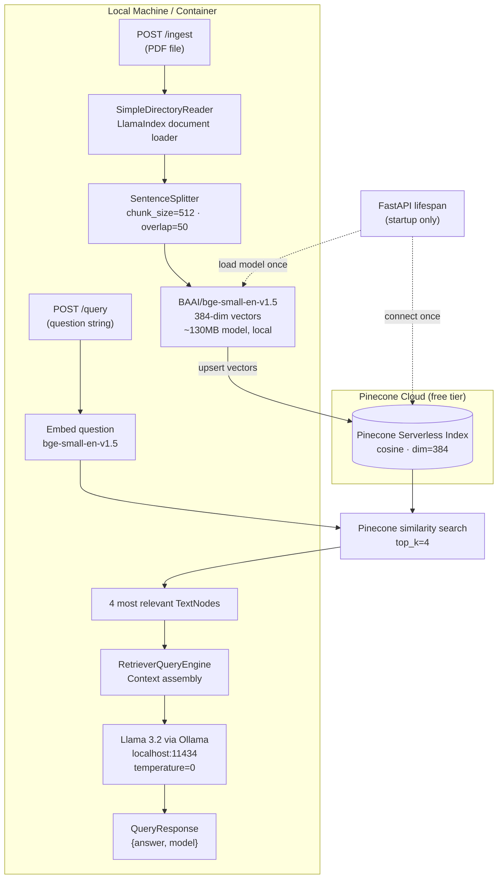

# Local LLM RAG — Llama 3.2 + HuggingFace + Pinecone + FastAPI

> Same RAG concept as Project 1 — but entirely cloud-agnostic for the LLM and embeddings, production-grade for the vector store, and exposed as a proper REST API instead of a demo UI. **Proves you're not locked to OpenAI or any cloud LLM provider.**


---

## Recent Changes

| Date | Change | Reason |
|------|--------|--------|
| May 2026 | Upgraded `llama-index-llms-ollama` 0.3.4 → 0.10.1, `llama-index-core` → 0.14.21 | `ollama==0.6.x` removed the `usage` field from `ChatResponse`; older LlamaIndex Ollama integration crashed on every query |
| May 2026 | Changed model name `llama3.2` → `llama3.2:3b` in config | Ollama stores the model under the explicit `:3b` tag when pulled with `ollama pull llama3.2:3b`; bare name returns 404 |
| May 2026 | Added `llama-index-core==0.14.21` to `requirements.txt` | Pin core version explicitly to avoid silent mismatches with integration packages |

---

## Skills Demonstrated

| Category | Technologies / Concepts |
|----------|------------------------|
| **Local LLM Deployment** | Ollama, Llama 3.2 (3B), GGUF quantization, CPU/GPU inference |
| **Embeddings** | HuggingFace sentence-transformers, BAAI/bge-small-en-v1.5 (384-dim), MTEB benchmark |
| **Vector Database** | Pinecone serverless, index creation, dimension matching, cosine similarity at scale |
| **RAG Framework** | LlamaIndex 0.11, Settings API (global config singleton), StorageContext |
| **REST API Design** | FastAPI, Pydantic v2 request/response models, CORS middleware, async endpoints |
| **App Lifecycle** | FastAPI lifespan context manager, one-time resource initialization |
| **Containerization** | Docker multi-stage build, docker-compose, host.docker.internal networking |
| **API Testing** | pytest, FastAPI TestClient, patching lifespan dependencies |

---

## What This Builds

**The Problem:** Projects 1 and 2 depend on cloud APIs (Gemini) for every query. This creates three real production constraints: (1) data privacy — medical/financial documents cannot be sent to third-party APIs; (2) cost at scale — cloud LLM tokens become expensive beyond prototype traffic; (3) vendor lock-in — if Google changes pricing or terms, the whole system breaks.

**The Solution:** A cloud-agnostic RAG stack. Llama 3.2 runs locally via Ollama (no API key, no token cost, data never leaves the machine). BAAI/bge-small-en-v1.5 embeddings run locally via HuggingFace (no API key, downloads once and caches). Pinecone handles vector storage in the cloud (managed, scalable, free tier for development).

**The Outcome:** A FastAPI REST backend you can deploy anywhere — a local server, a VM, or a Docker container. The same `/ingest` and `/query` endpoints work whether Ollama is on the same machine or a remote server.

```
POST /ingest  →  PDF bytes → Pinecone vectors (local embed + cloud store)
POST /query   →  question → Pinecone search → Llama 3.2 answer (everything local)
```

---

## Architecture



**What's local:** LLM inference (Ollama), embedding computation (HuggingFace), FastAPI process  
**What's cloud:** Vector storage and similarity search (Pinecone serverless)

---

## How It Works

### Component 1 — Ollama (Local LLM Server)

Ollama runs Llama 3.2 as a local HTTP server on port `11434`. The model is stored as a 4-bit GGUF-quantized file (~2GB), reducing memory from ~6GB (float32) to ~2GB with minimal quality loss.

```python
from llama_index.llms.ollama import Ollama

Settings.llm = Ollama(
    model="llama3.2:3b",
    base_url=os.getenv("OLLAMA_BASE_URL", "http://localhost:11434"),
    request_timeout=120.0,  # CPU inference can take 10-30s
    temperature=0.0,
)
```

**Why `request_timeout=120.0`?** On CPU-only machines, Llama 3.2 3B generates at 3-8 tokens/second. A 150-token answer takes 20-50 seconds. The default timeout of 30s causes failures on slower machines — 120s gives headroom while still catching actual hangs.

**Performance by hardware:**
- Apple Silicon (M1/M2/M3): ~15-25 tokens/sec via Metal GPU acceleration
- CPU-only (Intel/AMD): ~3-8 tokens/sec
- NVIDIA GPU (CUDA): ~50-100+ tokens/sec

### Component 2 — HuggingFace Embeddings (Local, Free)

```python
from llama_index.embeddings.huggingface import HuggingFaceEmbedding

embed_model = HuggingFaceEmbedding(model_name="BAAI/bge-small-en-v1.5")
```

The model downloads once to `~/.cache/huggingface/` (~130MB). All subsequent loads are instant from disk. The output is a 384-dimensional float vector — this number is hardcoded into the Pinecone index dimension and cannot be changed without deleting and recreating the index.

**Why BAAI/bge-small-en-v1.5 over all-MiniLM-L6-v2?** BGE (BAAI General Embedding) models are trained specifically for retrieval tasks using contrastive learning on question-passage pairs. On the MTEB (Massive Text Embedding Benchmark) retrieval track, `bge-small` outperforms `all-MiniLM-L6-v2` at the same 384-dim output size.

### Component 3 — LlamaIndex Settings API

LlamaIndex's global `Settings` singleton replaces the deprecated `ServiceContext` from 0.9.x:

```python
Settings.embed_model = embed_model          # Used by indexing pipeline
Settings.llm = Ollama(...)                 # Used by query engine
Settings.node_parser = SentenceSplitter(   # Used when chunking documents
    chunk_size=512,
    chunk_overlap=50,
)
```

Set once at startup. Every `VectorStoreIndex`, `RetrieverQueryEngine`, and node parser inherits these settings automatically — no need to thread them through every function.

**Why chunk_size=512 (vs 1000 in Project 1)?** Llama 3.2 3B has a smaller effective context window for coherent answers than Gemini 2.0 Flash. Injecting 4 × 512-char chunks (~2048 chars total) keeps the prompt within the model's reliable range while still providing meaningful context.

### Component 4 — Pinecone Serverless

```python
pc = Pinecone(api_key=os.getenv("PINECONE_API_KEY"))
pc.create_index(
    name="rag-demo",
    dimension=384,          # Must match bge-small output exactly
    metric="cosine",
    spec=ServerlessSpec(cloud="aws", region="us-east-1"),
)
```

Serverless spec means Pinecone manages all infrastructure — no pods to provision or scale. The free tier allows 1 index, 100K vectors, 1GB storage. `create_index` is safe to call repeatedly — `get_or_create_pinecone_index()` checks existing indexes first.

**The dimension contract:** If you change the embedding model (e.g., to `bge-base-en-v1.5` at 768-dim), you must delete the Pinecone index and recreate it with `dimension=768`. This is a hard constraint — upserted vectors must match the index dimension exactly.

### Component 5 — FastAPI Lifespan Pattern

```python
@asynccontextmanager
async def lifespan(app: FastAPI):
    # Runs ONCE at startup — before the first request
    embed_model = get_hf_embeddings()       # Loads 130MB model
    configure_settings(embed_model)
    pinecone_index = get_or_create_pinecone_index()
    state.vector_store = get_vector_store(pinecone_index)
    yield
    # Runs ONCE at shutdown — cleanup goes here

app = FastAPI(lifespan=lifespan)
```

Without lifespan: loading the 130MB HuggingFace model inside `/ingest` adds 30 seconds to the first request. The Pinecone connection would re-authenticate on every call. Lifespan ensures expensive one-time initialization happens at startup, not per-request.

---

## Key Engineering Decisions

| Decision | Choice | Alternative | Why This Choice |
|----------|--------|-------------|-----------------|
| **LLM** | Llama 3.2 via Ollama | Gemini 2.0 Flash (API) | Zero API cost, data stays local, no vendor dependency |
| **Embeddings** | BAAI/bge-small-en-v1.5 (local) | Google text-embedding-004 (API) | No API key needed, MTEB retrieval rank higher than all-MiniLM at same size |
| **Vector store** | Pinecone (cloud) | ChromaDB (local, used in P1) | Production-grade managed infra; demonstrates both options across portfolio |
| **Chunk size** | 512 chars / 50 overlap | 1000/200 (Project 1) | Smaller for Llama 3.2's context window; tuned to keep 4-chunk context under 2K chars |
| **Interface** | FastAPI REST API | Streamlit UI | Testable endpoints, integrable from any frontend, shows backend API skills |
| **Docker networking** | `host.docker.internal:11434` | Ollama inside container | CPU-only Ollama in Docker is too slow; host machine's GPU/Metal benefits from native Ollama |
| **Framework** | LlamaIndex | LangChain (Project 1) | Intentional variety; data-centric workloads fit LlamaIndex's document-first design |

---

## Tech Stack

| Component | Technology | Version | Why |
|-----------|-----------|---------|-----|
| LLM | Llama 3.2 (via Ollama) | 3B Q4_K_M | Free, local, private; runs on CPU without GPU |
| Embeddings | BAAI/bge-small-en-v1.5 | via sentence-transformers 3.3.1 | Best MTEB retrieval score at 384-dim, fully local |
| Vector Store | Pinecone serverless | 5.0.1 | Managed cloud infra, production-grade, free tier available |
| RAG Framework | LlamaIndex | 0.11.23 | Data-centric design; Settings API cleaner than LangChain for this pattern |
| REST API | FastAPI | 0.115.5 | Async, Pydantic validation, auto OpenAPI docs |
| Validation | Pydantic v2 | bundled with FastAPI | Request/response models with type safety and auto-generated docs |
| Container | Docker + docker-compose | — | One-command deployment; `extra_hosts` for host.docker.internal on Linux |
| PDF parsing | LlamaIndex SimpleDirectoryReader | via pypdf 5.1.0 | Handles PDF, TXT, DOCX natively |
| Testing | pytest + FastAPI TestClient | 8.3.4 | Sync test client; lifespan dependencies mocked via `patch` |

---

## Quick Start

```bash
# Prerequisites (one-time)
brew install ollama              # or: curl -fsSL https://ollama.com/install.sh | sh
ollama pull llama3.2:3b          # ~2GB download (use :3b tag explicitly)
ollama serve                     # Starts API at localhost:11434

# Project setup
git clone https://github.com/themoizqureshi/local-llm-rag-pinecone
cd local-llm-rag-pinecone

cp .env.example .env
# Add PINECONE_API_KEY from https://pinecone.io (free account → free serverless index)

uv venv && source .venv/bin/activate
uv pip install -r requirements.txt

# Run the API (first start downloads HuggingFace model ~130MB)
uvicorn src.api:app --reload --port 8000
# Interactive API docs: http://localhost:8000/docs
```

**Using the API:**

```bash
# Index a PDF
curl -X POST http://localhost:8000/ingest \
  -F "file=@/path/to/your/document.pdf"
# → {"message": "Successfully indexed document.pdf", "chunks_indexed": 42}

# Ask a question
curl -X POST http://localhost:8000/query \
  -H "Content-Type: application/json" \
  -d '{"question": "What is the main finding of this document?"}'
# → {"answer": "...", "model": "llama3.2:3b"}

# Health check
curl http://localhost:8000/health
# → {"status": "ok", "model": "llama3.2:3b", "vectorstore": "pinecone", "document_loaded": true}
```

## Running with Docker

```bash
# Ollama must be running on your host machine first
docker-compose up --build
# API available at http://localhost:8000
```

## Running Tests

```bash
pytest tests/ -v
# All 5 tests pass without Pinecone/Ollama/HuggingFace (all mocked)
```

---

## Testing with Your Own Data

**Prerequisites (one-time setup):**
```bash
# 1. Install and start Ollama
curl -fsSL https://ollama.ai/install.sh | sh
ollama serve                    # keep running in a terminal
ollama pull llama3.2:3b         # ~2 GB download

# 2. Get a free Pinecone key at pinecone.io → add to .env:
# PINECONE_API_KEY=pcsk_...
```

**Run the Streamlit UI:**
```bash
streamlit run app.py
# Opens at http://localhost:8501
# The sidebar shows ✅/❌ status for Ollama and Pinecone
```

**Or use the FastAPI directly:**
```bash
uvicorn src.api:app --reload --port 8000

# Upload a PDF:
curl -X POST http://localhost:8000/ingest \
  -F "file=@your_document.pdf"

# Ask a question:
curl -X POST http://localhost:8000/query \
  -H "Content-Type: application/json" \
  -d '{"question": "What is this document about?"}'
```

**Any PDF works.** The embedding model (BAAI/bge-small-en-v1.5) and LLM (llama3.2:3b) are both local — no cloud API calls after the one-time model downloads. First ingest downloads the ~90 MB embedding model.

---

## Project Structure

```
local-llm-rag-pinecone/
├── src/
│   ├── embeddings.py       # get_hf_embeddings() — HuggingFaceEmbedding wrapper
│   ├── pinecone_store.py   # get_or_create_pinecone_index(), get_vector_store()
│   ├── ingestion.py        # load_pdf(), load_directory() — LlamaIndex SimpleDirectoryReader
│   ├── chain.py            # configure_settings(), build_index(), build_query_engine()
│   └── api.py              # FastAPI app, lifespan, /health /ingest /query endpoints
├── tests/
│   └── test_api.py         # 5 endpoint tests: health, pre-ingest query, non-PDF rejection,
│                           #   ingest success, query-after-ingest
├── Dockerfile              # python:3.11-slim, pip install, uvicorn CMD
├── docker-compose.yml      # API service + host.docker.internal for Ollama access
└── docs/
    └── architecture.md     # Mermaid diagram + local vs cloud component table
```

---

## Production Considerations

| Concern | Current State | Production Approach |
|---------|--------------|---------------------|
| **Authentication** | None — open API | Add OAuth2/API key middleware in FastAPI |
| **Multi-document** | One document at a time (state.query_engine replaced on ingest) | Use Pinecone namespaces per document/user; store namespace in session token |
| **Concurrency** | Single Ollama process | Run multiple Ollama instances behind a load balancer; use async streaming responses |
| **Model serving** | Ollama on developer's laptop | vLLM or TGI for GPU inference servers; Ollama for CPU-only edge deployment |
| **Cold start** | 130MB model load at startup | Pre-load in Docker image; use Kubernetes readiness probe to hold traffic until model is warm |
| **Pinecone scaling** | Free tier (100K vectors) | Paid tier for >100K vectors; use namespaces to separate tenants |
| **Embedding drift** | Model fixed at bge-small-en-v1.5 | Pin model version; re-embed all documents if model is updated (breaking change) |
| **GPU in Docker** | Not configured | Add NVIDIA runtime to docker-compose; expose GPU with `deploy.resources.reservations` |

---

## Lessons Learned

- The Pinecone dimension mismatch error (`Vector dimension 768 does not match the dimension of the index 384`) only surfaces at upsert time, not at index creation. It cost 10 minutes the first time because the error appeared on the second API call. Always validate `len(embed_model.get_text_embedding("test"))` before creating the index.
- Llama 3.2 on Apple Silicon (M2) via Ollama runs at ~12–18 tokens/sec with Metal GPU acceleration — acceptable for a demo, but not for production endpoints with concurrent users. CPU-only machines drop to 3–5 tokens/sec, which noticeably degrades the feel of the `/query` endpoint.
- FastAPI's lifespan context manager is not optional here: loading the 130MB HuggingFace model inside the first `/ingest` call adds 25–30 seconds of cold-start latency. Moving it to lifespan makes the cost startup-time rather than request-time.
- LlamaIndex's `Settings` singleton doesn't hot-reload — changing `Settings.embed_model` at runtime doesn't propagate to already-built indexes. Correct behavior, but it took one confusing debugging session to understand. Treat `Settings` as write-once-at-startup.

---

*Part of the [AI Engineer Portfolio](https://github.com/themoizqureshi) — Project 3 of 5.*  
*Previous: [Project 2 — RAG Evaluation Pipeline](https://github.com/themoizqureshi/rag-evaluation-pipeline)*  
*Next: [Project 4 — Multi-Agent LangGraph](https://github.com/themoizqureshi/multi-agent-langgraph)*
