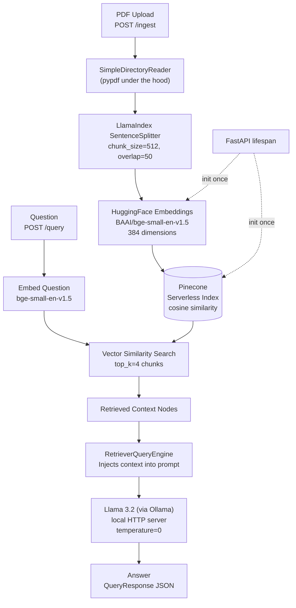

# Architecture — Local LLM RAG with Pinecone

## Pipeline Overview



## What Runs Locally vs in the Cloud

| Component | Where It Runs | Notes |
|-----------|--------------|-------|
| FastAPI app | Local / Docker | `uvicorn src.api:app` |
| Llama 3.2 | Local (Ollama) | `ollama run llama3.2` |
| HuggingFace embeddings | Local | Downloaded to `~/.cache/huggingface` |
| Pinecone index | Cloud (free tier) | Managed, serverless, 1 free index |

## Key Differences vs Project 1 (LangChain + ChromaDB)

| Dimension | Project 1 | Project 3 |
|-----------|-----------|-----------|
| Framework | LangChain LCEL | LlamaIndex Settings API |
| LLM | Gemini 2.0 Flash (API) | Llama 3.2 (local via Ollama) |
| Embeddings | Google text-embedding-004 (API) | BAAI/bge-small-en-v1.5 (local) |
| Vector Store | ChromaDB (local disk) | Pinecone (managed cloud) |
| Interface | Streamlit UI | FastAPI REST API |
| API Key Required | GOOGLE_API_KEY | PINECONE_API_KEY only |

## FastAPI Startup Sequence

```
uvicorn src.api:app
       │
       ▼
lifespan() starts
       │
       ├── get_hf_embeddings()         → loads bge-small model (~130MB, once)
       ├── configure_settings()        → sets LlamaIndex globals
       ├── get_or_create_pinecone_index() → connects to Pinecone
       └── get_vector_store()          → wraps index as LlamaIndex store
       │
       ▼
Server ready at http://localhost:8000
       │
POST /ingest  →  load PDF → chunk → embed → upsert to Pinecone
POST /query   →  embed question → search Pinecone → Llama 3.2 answers
```
